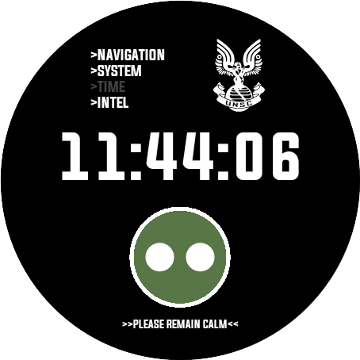
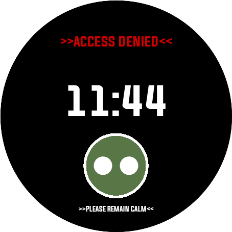

<h1>
Superintendent watchface Wear OS
</h1>

<h2>
>>Description<<
</h2>

This repository contains a watchface inspired in Halo 3 ODST AI (the superintendent). It is built using Kotlin, drawing the watchface through canvas. It only supports circle devices right now.

<h2>
>>Screenshots<<
</h2>

<h2>
>>Coming soon<<
</h2>

>> Square devices
 
>> Customizations
 
>> Editor app

<h2>
>>Please remain calm<<
</h2>

